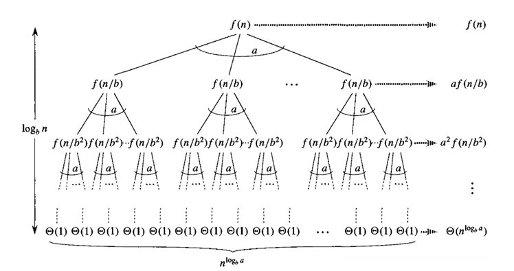

# Divide et Impera 

## 1. Conceptul de bază

Divide et Impera este o tehnică algoritmică bazată pe:

1. **Divide** — împărțirea problemei în subprobleme similare.
2. **Conquer** — rezolvarea subproblemelor (recursiv sau direct).
3. **Combine** — combinarea soluțiilor pentru a obține rezultatul final.

------------------------------------------------------------------------

## 2. Structura generală

```python
def divide_et_impera(t, st, dr):
    # 1. CAZ DE BAZĂ (Oprire)
    # Verificăm dacă problema e suficient de mică pentru a fi rezolvată direct
    if st == dr: 
        return t[st]  # Sau altă rezolvare directă

    # 2. DIVIDE (Descompunere)
    # Găsim punctul de separare (mijlocul)
    mij = (st + dr) // 2
    
    # 3. IMPERA (Rezolvare recursivă)
    # Apelăm funcția pentru cele două jumătăți
    sol_stanga  = divide_et_impera(t, st, mij)
    sol_dreapta = divide_et_impera(t, mij + 1, dr)
    
    # 4. COMBINĂ (Reconstituire)
    # Unim rezultatele parțiale pentru a obține soluția finală
    return combina(sol_stanga, sol_dreapta)

```

## 3. Relațiile de recurență - Teorema Master

Complexitatea algoritmilor Divide et Impera se exprimă prin:

$$
T(n) = a \cdot T\left(\frac{n}{b}\right) + f(n)
$$


unde:  
- **a** = numărul subproblemelor  
- **b** = factorul de împărțire  
- **f(n)** = costul divizării + combinării

------------------------------------------------------------------------
Dacă $f(n) = O(n^c)$ :

### **Cazul 1** — Subdominant

Dacă $c < \log_b a$, atunci:

$$
T(n) = \Theta(n^{\log_b a})
$$


### **Cazul 2** — Echilibru

Dacă $c = \log_b a$, atunci:

$$
T(n) = \Theta(n^{\log_b a} \log n)
$$


### **Cazul 3** — Dominant

Dacă $c > \log_b a$ și există o constantă $k < 1$ astfel încât:

$$
a \cdot f\left(\frac{n}{b}\right) \le k \cdot f(n)
$$

atunci:

$$
T(n) = \Theta(f(n))
$$


 ---------------------------------------------------------------

| Situație | Cine câștigă? | Cazul | Rezultat Final |
| :--- | :--- | :--- | :--- |
| **$$c < E$$** | **Frunzele** (baza arborelui) | **1** | $$T(n) = \Theta(n^E)$$ |
| **$$c = E$$** | **Egalitate** (cost uniform) | **2** | $$T(n) = \Theta(n^E \log n)$$ |
| **$$c > E$$** | **Rădăcina** (costul de sus) | **3** | $$T(n) = \Theta(f(n))$$ |

----

#### Exemplul 1: Cazul Subdominant (Frunzele câștigă)
Recurența: $$T(n) = 4T(n/2) + n$$

1.  **Parametri:** $$a=4$$, $$b=2$$, $$f(n) = n^1 \Rightarrow c=1$$.
2.  **Exponent critic:** $$E = \log_2 4 = 2$$.
3.  **Comparație:** $$c = 1 < 2 = E$$.
4.  **Concluzie:** Câștigă termenul critic $$n^E$$.
    $$T(n) = \Theta(n^2)$$

----

#### Exemplul 2: Cazul Echilibrat (Merge Sort)
Recurența: $$T(n) = 2T(n/2) + n$$

1.  **Parametri:** $$a=2$$, $$b=2$$, $$f(n) = n^1 \Rightarrow c=1$$.
2.  **Exponent critic:** $$E = \log_2 2 = 1$$.
3.  **Comparație:** $$c = 1 = 1 = E$$.
4.  **Concluzie:** Sunt egale. Înmulțim cu $$\log n$$.
    $$T(n) = \Theta(n^1 \log n) = \Theta(n \log n)$$

----
    

#### Exemplul 3: Cazul Dominant (Rădăcina câștigă)
Recurența: $$T(n) = T(n/2) + n^2$$

1.  **Parametri:** $$a=1$$, $$b=2$$, $$f(n) = n^2 \Rightarrow c=2$$.
2.  **Exponent critic:** $$E = \log_2 1 = 0$$.
3.  **Comparație:** $$c = 2 > 0 = E$$.
4.  **Concluzie:** Câștigă funcția $$f(n)$$.
    $$T(n) = \Theta(n^2)$$


------------------------------------------------------------------------

## 4. Proprietăți și avantaje

* **Eficiență:** Foarte eficient pentru subprobleme **disjuncte și echilibrate**.
* **Simplitate:** Implementări naturale în recursivitate.
* **Performanță:** Adesea produce complexități optime: $$O(n)$$, $$O(n \log n)$$, $$O(\log n)$$.
* **Paralelizare:** Permite execuție simultană evidentă datorită independenței subproblemelor.
* **Scalabilitate:** Comportament excelent pentru inputuri mari.

------------------------------------------------------------------------

## 5. Exemplu de problemă 

### **Determinarea elementului maxim dintr-o listă prin Divide et Impera**

**Idee:** împărțim lista în două jumătăți, găsim maximul în fiecare, apoi alegem maximul dintre cele două.

### Pseudocod:

```python
function MAXIM(A, st, dr):
    if st == dr:
        return A[st]

    mij = (st + dr) // 2
    max_st = MAXIM(A, st, mij)
    max_dr = MAXIM(A, mij+1, dr)

    return max(max_st, max_dr)
```

### Recurența:

### Exemplu 

**$$T(n) = 2T\left(\frac{n}{2}\right) + O(1)$$**

**1. Identificare parametri:**
* $$a = 2$$
* $$b = 2$$
* $$f(n) = O(1) \implies n^c = n^0 \implies c = 0$$


**2. Calculul exponentului critic:**

$$
\log_b a = \log_2 2 = 1
$$

**3. Comparație:**

Comparăm exponentul funcției ($c$) cu cel critic:

$$
c = 0 < 1 = \log_b a
$$

Deoarece $$c < \log_b a$$, ne aflăm în **Cazul 1 (Subdominant)**.

**✅ Rezultat:**

$$
T(n) = \Theta(n^{\log_b a}) = \Theta(n^1) = \Theta(n)
$$

------------------------------------------------------------------------

## 6. Aplicații clasice

- căutare binară  
- Mergesort  
- selecția medianei (quickselect)  
- probleme geometrice (cel mai apropiat cuplu de puncte)

------------------------------------------------------------------------

## 7. Când NU folosim Divide et Impera? 

Deși este o tehnică puternică, Divide et Impera **nu** este eficientă dacă subproblemele se suprapun (se repetă).

### Exemplu clasic: Șirul lui Fibonacci
Dacă încercăm să calculăm al $n$-lea termen Fibonacci recursiv:
$$F(n) = F(n-1) + F(n-2)$$

* **Problema:** Aceeași valoare este recalculată de nenumărate ori.
* **Complexitate:** Devine **exponențială** $(O(2^n))$, ceea ce este inacceptabil pentru $n$ mare.
* **Soluția:** Pentru probleme cu subprobleme suprapuse, se folosește **Programarea Dinamică**.

> **Regulă de aur:** Divide et Impera este ideală când subproblemele sunt **disjuncte** (independente unele de altele).

---

## 8. Extra

### A. Căutarea Binară (Binary Search)
*Algoritm care caută un element într-o listă sortată prin înjumătățire.*

**Analiză:**
La fiecare pas, comparăm mijlocul și alegem **o singură** jumătate în care să continuăm. Nu procesăm ambele jumătăți!.

1.  **Recurența:**
    $$T(n) = T\left(\frac{n}{2}\right) + O(1)$$
    * $a = 1$ (rezolvăm o singură subproblemă)
    * $b = 2$ (împărțim dimensiunea la 2)
    * $f(n) = O(1)$ (cost constant de comparare)

2.  **Aplicare Teorema Master:**
    * Calculăm exponentul critic: $\log_b a = \log_2 1 = 0$.
    * Avem $f(n) = O(1) = O(n^0)$.
    * Suntem în cazul de **Echilibru** ($c = \log_b a$).

**Rezultat:**
$$T(n) = \Theta(n^0 \log n) = \Theta(\log n)$$

---

### B. Sortarea prin Interclasare (Merge Sort)
*Algoritm care sortează două jumătăți recursiv și apoi le combină (interclasează).*

**Analiză:**
Aici trebuie să sortăm **ambele** jumătăți, iar apoi să parcurgem elementele pentru a le "uni" (interclasare).

1.  **Recurența:**
    $$T(n) = 2T\left(\frac{n}{2}\right) + O(n)$$
    * $a = 2$ (avem 2 subprobleme de rezolvat)
    * $b = 2$ (dimensiunea se înjumătățește)
    * $(f(n) = O(n))$ (interclasarea necesită parcurgerea listei).

2.  **Aplicare Teorema Master:**
    * Calculăm exponentul critic: $\log_b a = \log_2 2 = 1$.
    * Avem $f(n) = O(n^1)$.
    * Suntem din nou în cazul de **Echilibru** ($c = \log_b a$), deoarece $1 = 1$.

**Rezultat:**
$$T(n) = \Theta(n^1 \log n) = \Theta(n \log n)$$

---

## 9. Vizualizare: Arborele de Recursie

Pentru a înțelege mai bine complexitatea, ne putem imagina execuția algoritmului ca un arbore, unde fiecare nod reprezintă o subproblemă, iar costul se distribuie astfel:

1.  **Nivelul 0 (Rădăcina):** Problema inițială, cu costul $$f(n)$$.
2. **Nivelul 1:** Avem $a$ subprobleme, fiecare de dimensiune $\frac{n}{b}$, având costul total $a \cdot f\left(\frac{n}{b}\right)$.
3.  **...** (procesul continuă până la dimensiunea 1)
4.  **Ultimul nivel (Frunzele):** Cazurile de bază.

### Structura costurilor pe nivel

| Nivel | Nr. Noduri | Cost pe nod | Cost total pe nivel |
| :--- | :--- | :--- | :--- |
| **0** | $$1$$|$$f(n)$$|$$f(n)$$ |
| **1** | $$a$$|$$f(n/b)$$|$$a \cdot f(n/b)$$ |
| ... | ... | ... | ... |
| **k** | $$a^k$$|$$O(1)$$|$$\Theta(n^{\log_b a})$$ |

-----------------------------------------------------------------------------------------------

<p align="center">
  
  <br>
  <em>Figura 1: Arborele de recursie</em>
</p>

---

### Interpretare: Cine "câștigă"?

Suma costurilor pe fiecare nivel ne indică direct cazul din Teorema Master:

*  **Dacă costul scade geometric** pe măsură ce coborâm în arbore $\rightarrow$ Costul total este dominat de **Rădăcină** (Cazul 3).
*  **Dacă costul este constant** pe fiecare nivel $\rightarrow$ Costul total este $$CostNivel \times Înălțime$$ (Cazul 2).
*  **Dacă costul crește geometric** spre bază $\rightarrow$ Costul total este dominat de **Frunze** (Cazul 1).


## 📐 Formule Matematice Esențiale

---

### 1. Progresia Aritmetică (Bucle)

Termenii cresc constant (cu o rație $$r$$).

**Formula Sumei:** $S_n = \frac{n(a_1 + a_n)}{2}$

* *Suma lui Gauss:*
Suma numerelor de la $1$ la $n$ (unde $a_1=1, a_n=n$):

$$
\sum_{i=1}^{n} i = 1 + 2 + \dots + n = \frac{n(n+1)}{2} \in \Theta(n^2)
$$

---

### 2. Progresia Geometrică (Recursivitate)

Apare în **Divide et Impera** (Arborele de recursie).
Termenii cresc/scad multiplicativ (cu o rație $$q$$).

**Formula Sumei ($q \neq 1$):**

$$
S_n = a_1 \cdot \frac{q^n - 1}{q - 1}
$$


