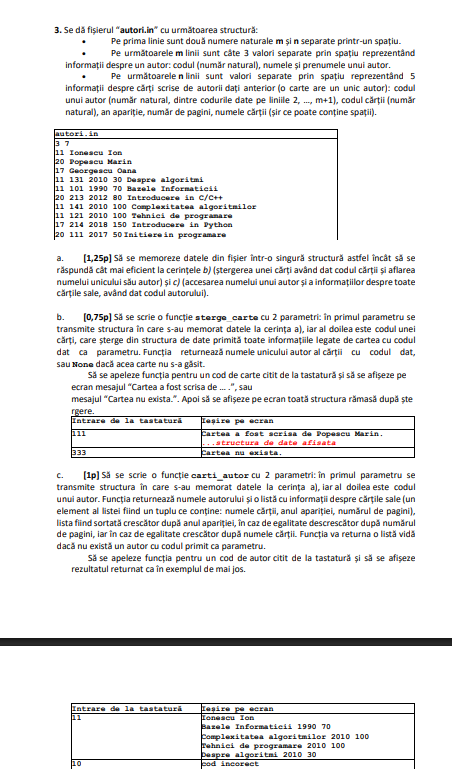
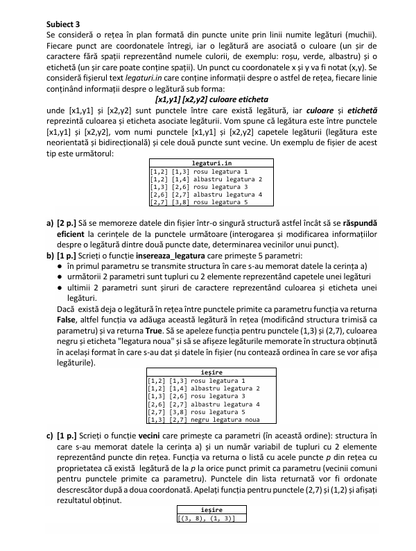
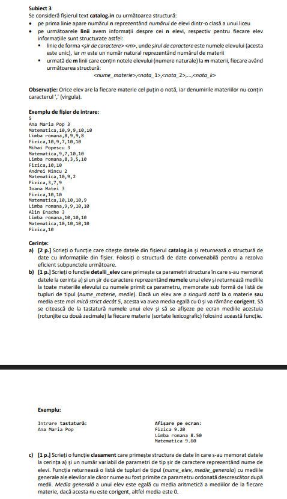
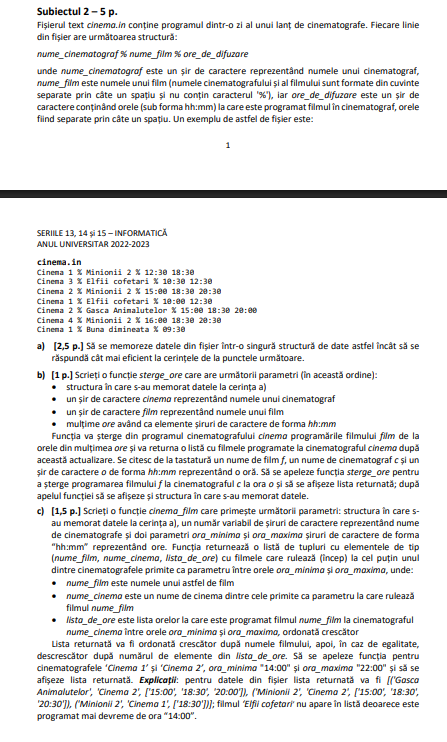

# Rezolvări Probleme


### Problema 1 (2021)


**Fișier intrare: `autori.in`**
```text
3 7
11 Ionescu Ion
20 Popescu Marin
17 Georgescu Oana
11 131 2010 30 Despre algoritmi
11 101 1990 70 Bazele Informaticii
20 213 2012 80 Introducere in C/C++
11 141 2010 100 Complexitatea algoritmilor
11 121 2010 100 Tehnici de programare
17 214 2018 150 Introducere in Python
20 111 2017 50 Initiere in programare
```
<br>


---

### Problema 2 (2022)


**Fișier intrare: `legaturi.in`**
```text
[1,2] [1,3] rosu legatura 1
[1,2] [1,4] albastru legatura 2
[1,3] [2,6] rosu legatura 3
[2,6] [2,7] albastru legatura 4
[2,7] [3,8] rosu legatura 5
```

<br>


---

### Problema 3 (2021)


**Fișier intrare: `catalog.in`**
```text
5
Ana Maria Pop 3
Matematica,10,9,9,10,10
Limba romana,8,9,9,8
Fizica,10,9,7,10,10
Mihai Popescu 3
Matematica,9,7,10,10
Limba romana,8,3,5,10
Fizica,10,10
Andrei Mincu 2
Matematica,10,9,2
Fizica,3,7,9
Ioana Matei 3
Fizica,10,10
Matematica,10,10,10,9
Limba romana,9,9,10,10
Alin Enache 3
Limba romana,10,10,10
Matematica,10,10,10,10
Fizica,10
```
<br>

---

### Problema 4 (2022)


**Fișier intrare: `cinema.in`**
```text
Cinema 1 % Minionii 2 % 12:30 18:30
Cinema 3 % Elfii cofetari % 10:30 12:30
Cinema 2 % Minionii 2 % 15:00 18:30 20:30
Cinema 1 % Elfii cofetari % 10:00 12:30
Cinema 2 % Gasca Animalutelor % 15:00 18:30 20:00
Cinema 4 % Minionii 2 % 16:00 18:30 20:30
Cinema 1 % Buna dimineata % 09:30
```
<br>
